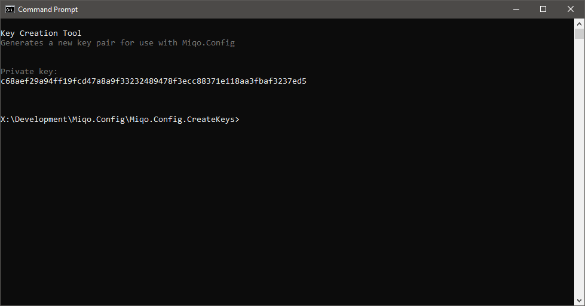

<h1 align="center">
  <br>
  
  <br>
  Miqo.Config
  <br>
</h1>
<h3 align="center">
	:page_facing_up::star2: The easy to use configuration file manager for .NET
</h3>
<p align="center">
<a href="https://ci.appveyor.com/project/natsuo/miqo-config"></a>
</p>

## Overview

Writing repetitive code to manage, read and write configuration files for every project is tedious. Let Miqo.Config take care of the heavy lifting of managing configuration files for you, so you can focus on your project.

Miqo.Config helps translate your strongly typed object to a JSON configuration file.

The library is available for .NET Standard 2.0 and .NET Framework 4.0 and higher. The tests project uses .NET Core 2.0.

## Adding Miqo.Config to Your Project

The library is available as a signed NuGet package.

```
PM> Install-Package Miqo.Config
```

## Creating the Configuration Class

Start by creating a class to hold your configurations.

```csharp
public class Configuration {
	public string Server { get; set; }
	public int Port { get; set; }
	public List<string> { get; set; }
}
```

## Reading a Configuration File

Reading the application settings from a JSON file is done in the following way:

```csharp
var config = new Miqo.Config.ConfigurationManager()
	.ApplicationSettings()
	.LoadConfigurationFromFile<Configuration>("Spiffy.json");

Console.Writeline(config.ConnectionString);
```

Miqo.Config can also load a configuration from a JSON based string:

```csharp
var string json = "{ \"Server\": \"localhost\" }";

var config = new Miqo.Config.ConfigurationManager()
	.ApplicationSettings()
	.LoadConfigurationFromString<Configuration>(json);

Console.Writeline(config.ConnectionString);
```

Application wide configurations are stored in the same directory as the application. A custom location can be specified using ```ApplicationSettings(string directory)```.

## Writing Settings to a Configuration File

```csharp
var config = new Configuration {
	Server = "localhost",
	Port = 8080,
	IndexFiles = new List<string> {"index.html", "index.htm", "index.php"}
};

new Miqo.Config.ConfigurationManager()
	.ApplicationSettings()
	.SaveConfiguration(config)
	.ToFile("Spiffy.json");
```
The following file will be created in the application's folder:

```json
{
	"Server": "localhost",
	"Port": 8080,
	"IndexFiles": [
		"index.html",
		"index.htm",
		"index.php"
	]
}
```

## User Specific Settings

You can have application and user specific settings that are unrelated to each other. For instance, you can save the main window's position and size in it's own configuration file.

```csharp
new Miqo.Config.ConfigurationManager()
	.UserSettings("SpiffyApp")
	.SaveConfiguration(config)
	.ToFile("Spiffy.json");
```

Use ```UserSettings(string appName)``` instead of ```ApplicationSettings()``` to save the configuration to the currently logged in user's ApplicationData folder. You can specify a subfolder for your particular application's data.

## Additional features

Miqo.Config has some other nifty features that may be useful to you as a developer.

### Logging

You can add logging capabilities to Miqo.Config by using the Log delegate. You add Serilog logging in the following way:

```csharp
var log = Log.Logger = new LoggerConfiguration()
	.WriteTo.Console()
	.CreateLogger();

var cm = new Miqo.Config.ConfigurationManager {
	Log = log.Information,
	LogException = log.Error
};

cm.ApplicationSettings()
	.SaveConfiguration(config)
	.ToFile("config.json");
```

### Protecting Sensitive Information

If you are storing usernames, password, connection strings, API keys or any other such sensitive data, you should consider encrypting the property. Add the ```[JsonConverter(typeof(EncryptedPropertyConverter), key)]``` attribute to the property.

Example:

```csharp
[JsonConverter(typeof(EncryptedPropertyConverter), "06c98cb49446d5200e272e4aa61566261278e53f6dc73a95f211694451787842")]
public string ConnectionString { get; set; }
```

Miqo.Config will encrypt the information before writing the property to the configuration file, and decrypt the information back into the property upon reading the configuration file. You can set your own key on a project to project basis. Miqo.Config uses AES to encrypt sensitive information.

Use the included [Key Creation Tool](./Miqo.Config.CreateKeys/) to generate a new key for your project.



### Ignoring Properties

If you would like to prevent properties from being serialized to the configuration file, use the ```[JsonIgnore]``` attribute.

```csharp
[JsonIgnore]
public string NotReallyAllThatImportant { get; set; }
```

## Acknowledgements

The library was inspired by [Config.Net](https://github.com/aloneguid/config) by Ivan Gavryliuk. The encryption code is based on code by [Ckode.Encryption](https://github.com/NQbbe/Ckode.Encryption/) by Steffen Skov.

## License

Miqo.License is made available under the [MIT License](LICENSE).
